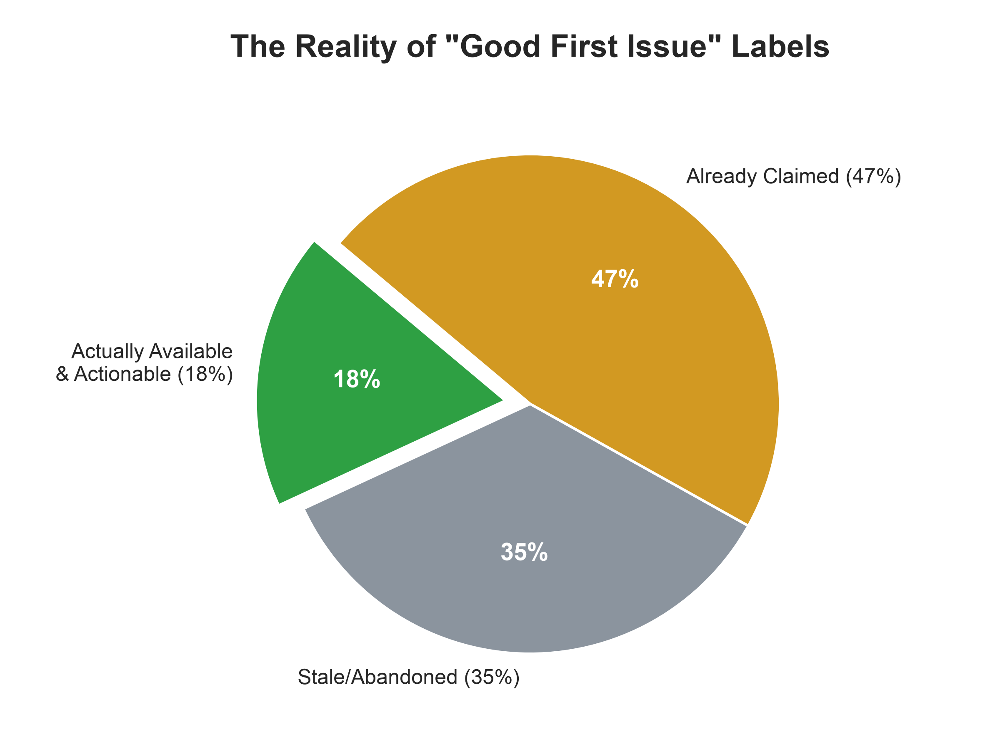
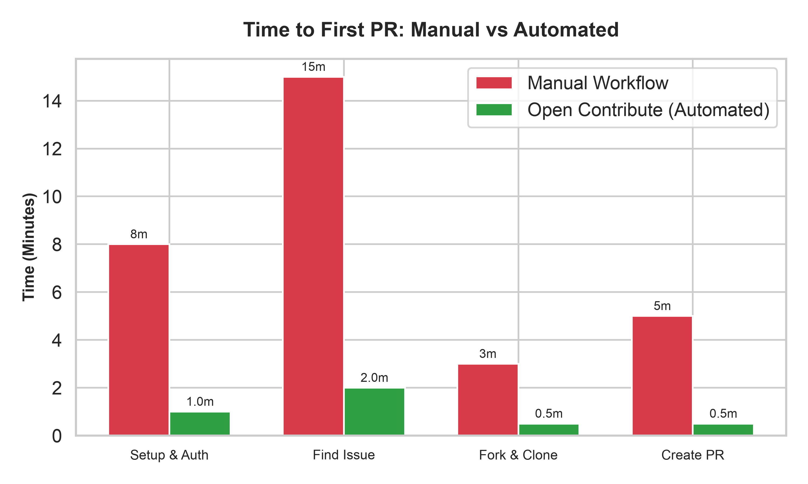

<div align="center">
  <h1>First-Contribution AI Skill</h1>
  <p><strong>"기여하고 싶다"에서 실제 PR 제출까지 데려다주는 Agent Skill.</strong></p>

  <p>
    <a href="https://github.com/chjnett/open_contribute/actions/workflows/ci.yml"></a>
    <a href="https://github.com/chjnett/open_contribute/issues"></a>
    <a href="./LICENSE"></a>
    
  </p>
</div>

---

한국어 | [English](./README.md)

## 개요

`good first issue` 라벨은 생각보다 자주 거짓말을 합니다. 인기 레포일수록 초보자용이라고 붙은 이슈는 이미 누가 선점했거나, 다른 PR로 해결됐거나, 조용히 마무리됐는데 이슈만 안 닫힌 경우가 흔합니다. 신나서 코드를 읽기 시작했는데 6개월 전에 걸린 PR을 발견하는 식이죠.

<div align="center">
  
</div>

이 스킬은 정확히 그 상황이 너무 자주 반복돼서 만들었습니다. AI 코딩 에디터(Claude Code, Cursor, Cowork) 안에서 자율 가이드로 동작하면서 죽은 이슈를 걸러내고, Git/GitHub CLI 작업을 대신 처리하고, 메인테이너가 바로 받아들일 수 있도록 PR을 다듬습니다.

<div align="center">
  
</div>

## 주요 기능

- **도메인별 분기:** 일반 오픈소스 기여(`first-contribution`)와 AI/RAG 프로젝트 전용(`rag-contribution`) 흐름을 각각 제공합니다.
- **PR 제출 전 품질 점검:** `pr-acceptance-checklist.md`를 강제해서 테스트, 포매팅, DCO 서명(`git commit -s`)이 갖춰진 뒤에야 PR을 열게 합니다.
- **GitHub CLI 자동화:** 토큰을 직접 만들 필요 없이 `gh`로 인증, 포크, 클론, 푸시까지 처리합니다.
- **이슈 검증:** 숨은 담당자나 연결된 PR이 있는 `good first issue`를 자동으로 걸러냅니다.
- **PR 머지 현실 게이트:** 겉보기 지표가 좋아도 외부인 PR이 실제로 머지되는지를 따로 측정해서, 승산 없는 레포에 시간을 쏟기 전에 알려줍니다.
- **아웃리치 초안 작성:** 이슈 선점 코멘트와 Discord/Slack 커뮤니티 메시지 초안을 대신 써줍니다.

---

## 사전 준비

이 스킬은 포크, 클론, PR 생성까지 자동화하며, 개인 액세스 토큰(PAT)을 직접 만들 필요가 없습니다. 대신 **GitHub CLI (`gh`)** 가 설치되고 인증돼 있어야 합니다.

- **Mac:** `brew install gh`
- **Windows:** `winget install --id GitHub.cli`
- **Linux:** `sudo apt install gh`

설치 후 아래 명령으로 인증하세요. 워크플로 파일을 푸시할 권한까지 함께 받습니다:

```bash
gh auth login --scopes workflow
```

> **참고:** 안내에 따라 웹 브라우저로 인증하면 됩니다. (이후 SSH 호스트 키 오류가 나면 `gh config set git_protocol https`를 실행해보세요.)

---

## 설치

이 레포에는 스킬 3개가 들어있습니다. 원하는 걸 골라서 아래 폴더명만 바꿔 쓰세요:

| 폴더 | 응답 언어 | 용도 |
| :--- | :--- | :--- |
| `first-contribution` | 영어 | 모든 오픈소스 프로젝트 |
| `first-contribution-ko` | 한국어 | 모든 오픈소스 프로젝트 |
| `rag-contribution` | 영어 | RAG 프로젝트 (LangChain, LlamaIndex) |

### 가장 쉬운 방법 — 코딩 에이전트에 이 프롬프트를 붙여넣기

아래 블록을 Claude Code나 SKILL.md를 지원하는 에이전트에 복사해서 넣으세요.

```text
first-contribution-ko 에이전트 스킬만 설치해줘, 다른 건 건드리지 마.

1. 내 스킬 디렉토리를 확인해 (Claude Code → ~/.claude/skills/,
   그 외엔 해당 툴의 문서화된 스킬 디렉토리).
2. https://github.com/chjnett/open_contribute 를 임시 폴더에 클론해.
3. first-contribution-ko/ 하위 폴더를
   <스킬 디렉토리>/first-contribution-ko/ 으로 복사해.
4. 복사된 폴더 루트에 SKILL.md가 있는지 확인해.
5. 다른 파일, 설정, 스킬은 건드리지 마. 최종 설치 경로만 알려주고 끝내.
```

설치 후 에이전트를 재시작(혹은 새 세션 시작)하면 스킬을 인식합니다.

### Claude Code — 직접 폴더 복사

`~/.claude/skills/`(전역) 또는 `.claude/skills/`(프로젝트별)에 설치합니다:

```bash
git clone https://github.com/chjnett/open_contribute /tmp/open_contribute
cp -r /tmp/open_contribute/first-contribution-ko ~/.claude/skills/first-contribution-ko
```

### Claude.ai / Cowork — 패키징된 `.skill` 업로드

[최신 릴리스](https://github.com/chjnett/open_contribute/releases/latest)에서 원하는 변형의 `.skill` 파일을 받아 설정 → 스킬에서 업로드하세요. `SKILL.md` + `references/` 폴더를 직접 업로드해도 됩니다.

클론한 상태에서 `.skill` 파일을 직접 만들려면:

```bash
bash scripts/package_skill.sh
```

---

## 사용하기

설치 후엔 그냥 원하는 걸 자연스럽게 말하면 됩니다 — 별도 명령어 없이 의도만으로 트리거됩니다:

> *"오픈소스 기여 시작하고 싶어, 좋은 레포랑 이슈 찾아줘"*

> *"이 레포 초보자한테 괜찮아? https://github.com/langchain-ai/langchain"*

> *"RAG/Python 프로젝트 중에 good-first-issue 찾아줘"*

---

## 문제 해결

`gh` 인증이나 PR 생성 과정에서 막히면 아래를 참고하세요:

| 오류 메시지 / 증상 | 해결 방법 |
| :--- | :--- |
| **"refusing to allow an OAuth App to create or update workflow... without workflow scope"** | `gh` 토큰에 GitHub Actions가 포함된 레포로 푸시할 권한이 없습니다:<br>`gh auth refresh --scopes workflow` |
| **"The value of the GITHUB_TOKEN environment variable is being used for authentication."** | 환경변수에 남은 예전 토큰 때문에 갱신이 거부되고 있습니다. 먼저 지우세요:<br>`unset GITHUB_TOKEN` (Mac/Linux) 또는 `Remove-Item Env:\GITHUB_TOKEN` (Windows) |
| **"Host key verification failed" (클론 중)** | SSH 키가 설정되지 않았는데 SSH로 시도하고 있습니다. HTTPS를 기본으로 바꾸세요:<br>`gh config set git_protocol https` |

---

## 기여

실제로 기여하면서 실사용 결과를 바탕으로 공개적으로 계속 다듬는 중입니다. 죽은 이슈를 추천하거나, 레포 판단이 틀리거나, 프로젝트 관례를 놓치는 경우를 발견하시면 이슈로 알려주세요 — 정확히 그런 피드백이 체크리스트를 더 정교하게 만듭니다.

## 라이선스

[MIT](./LICENSE). 자유롭게 쓰고, 포크하고, 확장하세요.
