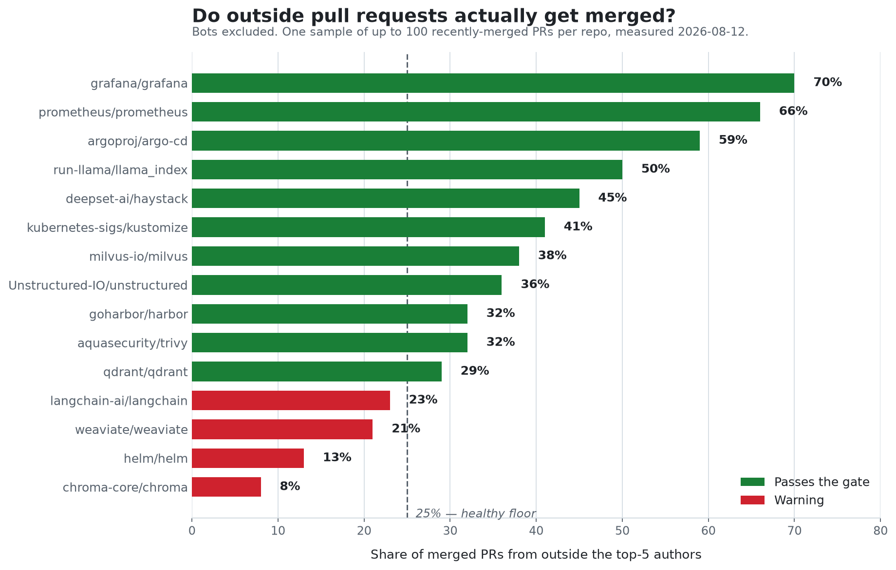
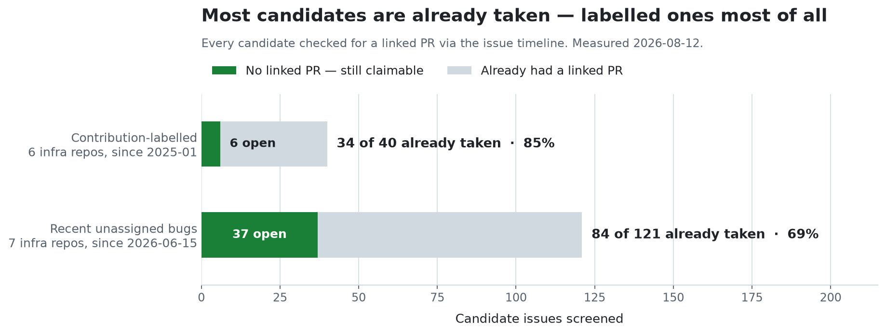

<div align="center">
  <h1>first-contribution</h1>
  <p><strong>"오픈소스에 기여하고 싶다"에서 PR 제출까지 데려다주는 Agent Skill — 이미 죽은 이슈로 보내지 않습니다.</strong></p>

  <p>
    <a href="https://github.com/chjnett/open_contribute/actions/workflows/ci.yml"></a>
    <a href="https://github.com/chjnett/open_contribute/releases/latest"></a>
    <a href="./LICENSE"></a>
    
  </p>
</div>

---

한국어 | [English](./README.md)

## 문제

`good first issue` 라벨은 거짓말을 합니다. 인기 레포에서 찾은 라벨 이슈는 대개 이미 누가 선점했거나, 다른 PR로 고쳐졌거나, 조용히 해결됐는데 아무도 안 닫은 것입니다. 코드를 읽고 몰입한 뒤에야 6개월 전에 걸린 PR을 발견하죠.

이건 그나마 눈에 보이는 절반입니다. 안 보이는 쪽이 더 나쁩니다 — 매일 커밋하고 분기당 수백 건을 머지하는 활발한 레포가, 정작 핵심 팀 바깥에서 온 PR은 거의 머지하지 않을 수 있습니다. 스타 수와 활동량은 **내 PR이 들어갈지**를 알려주지 않습니다.

<div align="center">
  
</div>

같은 날, 같은 방식으로 측정했습니다. `grafana/grafana`는 머지 PR의 70%가 상위 5명 밖에서 나옵니다. `chroma-core/chroma`는 8%이고, good-first-issue에 올라온 PR 17건이 **전부** 머지에 실패했습니다. 겉보기엔 둘 다 건강합니다.

그리고 경쟁이 있습니다. 최근에 올라온, 범위가 명확한, 라벨 붙은 이슈는 대개 몇 시간 안에 선점됩니다.

<div align="center">
  
</div>

이 스킬은 무언가를 추천하기 전에 이것들을 전부 측정합니다.

## 구성

| 스킬 | 응답 언어 | 용도 |
| :--- | :--- | :--- |
| `first-contribution` | 영어 | 모든 오픈소스 프로젝트 |
| `first-contribution-ko` | 한국어 | 모든 오픈소스 프로젝트 |
| `rag-contribution` | 영어 | RAG 프로젝트 (LangChain, LlamaIndex) |

각각 자체 완결형 Agent Skill입니다 — `SKILL.md`와 필요할 때 로드되는 `references/` 폴더.

## 작동 방식

1. **원하는 걸 먼저 좁힙니다** — 도메인, 세부 영역, 스택, 경험 수준, 기여 유형. 추측이 아니라 실제 선호에 기반한 추천이 나옵니다.
2. **가용성부터 거릅니다.** 지금 열려있는 미할당 기여 이슈가 없는 레포는 오늘 기여를 만들 수 없고, 그 확인은 API 호출 한 번이면 끝납니다. 살아남은 곳만 비싼 평가로 넘어갑니다.
3. **PR 머지 현실 게이트를 돌립니다** — 90일 이상 방치된 열린 PR 비율, 상위 5명 밖에서 온 머지 비율. 수치를 보여드리고 결정은 사용자가 합니다. 임의로 탈락시키지 않습니다.
4. **모든 후보 이슈를 8단계 체크리스트로 검증합니다** — 내부 전용 공지, 연결된 PR, 담당자, 해결 코멘트, 선점 적체, 나이, 그리고 마지막으로 **버그가 현재 코드에 아직 있는지**. 아무도 이슈를 닫지 않은 채 수정만 들어가는 경우가 있기 때문입니다.
5. **보낼 메시지를 대신 씁니다** — 선점 코멘트, 커뮤니티 채널 메시지, PR 설명을 그 프로젝트의 어투로.
6. **기여를 끝까지 안내합니다** — `gh` 기반 포크·클론, 범위를 좁힌 수정, 프로젝트의 실제 테스트, DCO·서명·CLA를 다루는 제출 전 점검, 그리고 제출 후 후속 대응 매너까지.

## 사전 준비

포크, 클론, PR 생성을 **GitHub CLI (`gh`)** 로 처리하므로 개인 액세스 토큰을 직접 만들 필요가 없습니다.

- **Mac:** `brew install gh`
- **Windows:** `winget install --id GitHub.cli`
- **Linux:** `sudo apt install gh`

```bash
gh auth login --scopes workflow
```

> 이후 SSH 호스트 키 오류가 나면 `gh config set git_protocol https`를 실행하세요.

## 설치

### 가장 쉬운 방법 — 코딩 에이전트에 이 프롬프트를 붙여넣기

원하는 변형으로 폴더명만 바꾸면 됩니다.

```text
first-contribution-ko 에이전트 스킬만 설치해줘, 다른 건 건드리지 마.

1. 내 스킬 디렉토리를 확인해 (Claude Code → ~/.claude/skills/,
   그 외엔 해당 툴의 문서화된 스킬 디렉토리).
2. https://github.com/chjnett/open_contribute 를 임시 폴더에 클론해.
3. first-contribution-ko/ 하위 폴더를
   <스킬 디렉토리>/first-contribution-ko/ 으로 복사해.
4. 복사된 폴더 루트에 SKILL.md가 있는지 확인해.
5. 다른 파일, 설정, 스킬은 건드리지 마. 최종 설치 경로만 알려주고 끝내.
```

설치 후 에이전트를 재시작하면 인식합니다.

### Claude Code — 직접 폴더 복사

```bash
git clone https://github.com/chjnett/open_contribute /tmp/open_contribute
cp -r /tmp/open_contribute/first-contribution-ko ~/.claude/skills/first-contribution-ko
```

### Claude.ai / Cowork — 패키징된 `.skill` 업로드

[최신 릴리스](https://github.com/chjnett/open_contribute/releases/latest)에서 원하는 변형을 받아 설정 → 스킬에서 업로드하세요. 클론한 상태에서 직접 만들려면:

```bash
bash scripts/package_skill.sh
```

## 사용하기

명령어 없이 의도만으로 트리거됩니다:

> *"오픈소스 기여 시작하고 싶어, 좋은 레포랑 이슈 찾아줘"*

> *"이 레포 초보자한테 괜찮아? https://github.com/langchain-ai/langchain"*

> *"RAG/Python 프로젝트 중에 good-first-issue 찾아줘"*

## 실전 기록

체크리스트의 모든 규칙은 실제 실행에서 대가를 치른 뒤에 추가됐습니다.

### 실제로 만들어낸 것

이 스킬이 아무것도 없는 상태에서 찾아내고 근본 원인까지 특정한 PR 두 건:

| PR | 버그 | 상태 |
| :--- | :--- | :--- |
| [grafana/grafana#130614](https://github.com/grafana/grafana/pull/130614) | 리소스 namespace를 org ID로 써서 복사된 짧은 URL에 `orgId=org-5`가 박힘 | 체크 전체 통과, 리뷰 중 |
| [directus/directus#28092](https://github.com/directus/directus/pull/28092) | M2A union에 프래그먼트를 쓰면 모든 필드가 `null` | 체크 전체 통과, patch coverage 100%, 리뷰 중 |

두 번째 실행이 깔때기를 더 잘 보여줍니다: 백엔드 레포 30곳 가용성 심사 → 기여 이슈가 열린 13곳 → 머지 게이트 통과 11곳 → **후보 이슈 229건 연결 PR 검사** → 아직 잡을 수 있는 26건 → `main`에서 버그 실재가 확인된 1건.

### 각 규칙이 치른 대가

- **`chroma-core/chroma`** — 스타 29k, 매일 푸시, 열린 `good first issue` 11건. 그런데 열린 PR 452건 중 275건이 90일 이상 방치, 머지 중 상위5 밖 비율 8%, 그리고 그 라벨 이슈들에 올라온 PR 17건이 전부 머지 실패. 게이트는 이 레포 때문에 생겼습니다.
- **`deepset-ai/haystack`** — 게이트를 여유롭게 통과하는데 기여 라벨은 *비어* 있습니다. 누적 199건 전부 닫힘, 열린 건 0건. 건강한 레포의 빈 라벨은 "나중에 다시 오라"는 뜻이고, 썩은 라벨과는 정반대 진단입니다.
- **`argoproj/argo-cd#29051`** — 8일 전 생성, 미할당, 연결 PR 0건, `severity:critical`. 모든 사회적 검증을 통과했지만 이미 `v3.3.14`가 고친 상태였습니다. 체크리스트가 현재 코드에서 버그를 확인하게 된 이유입니다.
- **두 PR 모두 기존 테스트가 버그를 기대값으로 박아두고 있었습니다.** grafana는 `orgId=org-5`를 기대했고, directus는 목 스키마에 `relations`만 있고 `collections`가 없어서 가장 자연스러운 수정안이 오히려 기존 테스트를 깨뜨렸을 겁니다. 수정 방식을 정하기 전에 픽스처를 읽으세요.
- **CLA는 방식이 제각각입니다.** grafana는 외부 서명 서비스를 쓰고, directus는 **PR 안에서** `contributors.yml`에 사용자명을 추가하게 합니다 — 한 줄 diff지만 그게 곧 서명 행위입니다. 이 스킬은 그걸 대신 해주지 않습니다.
- **내 PR에 대한 남의 요약은 상태가 아니라 주장입니다.** grafana PR에 "워크플로 28개가 승인 대기"라는 요약이 왔지만 API로는 0개였습니다. 그대로 따랐다면 있지도 않은 문제에 단 한 번의 재촉을 써버렸을 겁니다.

## 차트 재현

두 이미지는 2026-08-12에 실측한 데이터만 사용하며, 측정 방법이 차트에 함께 적혀 있습니다:

```bash
python3 scripts/generate_charts.py
```

## 문제 해결

| 오류 / 증상 | 해결 |
| :--- | :--- |
| **"refusing to allow an OAuth App to create or update workflow... without workflow scope"** | `gh` 토큰에 Actions 포함 레포 푸시 권한이 없습니다:<br>`gh auth refresh --scopes workflow` |
| **"The value of the GITHUB_TOKEN environment variable is being used for authentication."** | 환경변수에 예전 토큰이 남아 있습니다:<br>`unset GITHUB_TOKEN` (Mac/Linux) 또는 `Remove-Item Env:\GITHUB_TOKEN` (Windows) |
| 클론 중 **"Host key verification failed"** | SSH 키가 설정되지 않았습니다. HTTPS로 전환:<br>`gh config set git_protocol https` |
| **"Commits must have verified signatures"** | 서명된 커밋을 요구하는 레포입니다. `git commit -s`는 DCO sign-off라 이걸 **충족하지 않습니다** — 서명 키가 필요하거나, GraphQL `createCommitOnBranch`로 커밋하세요. |
| CLA 체크가 계속 pending | CLA는 본인만 서명할 수 있습니다. PR에 달린 봇 링크로 들어가세요. 화면이 비어 보이면 대개 콘텐츠 차단기가 약관 텍스트를 막고 있는 것입니다. |

## 기여

실제 기여에 쓰면서 공개적으로 다듬고 있습니다. 죽은 이슈를 추천하거나, 레포 판단이 틀리거나, 프로젝트 관례를 놓치면 이슈로 알려주세요 — 체크리스트는 그런 피드백으로 만들어졌습니다.

## 라이선스

[MIT](./LICENSE). 자유롭게 쓰고, 포크하고, 확장하세요.
