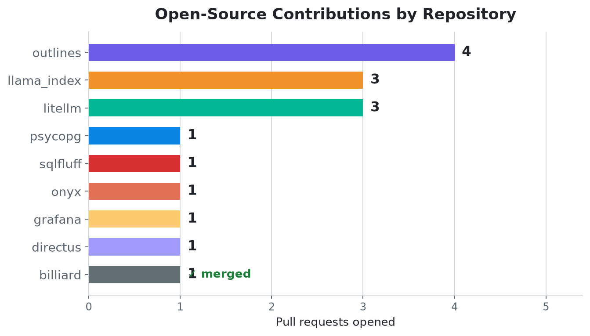
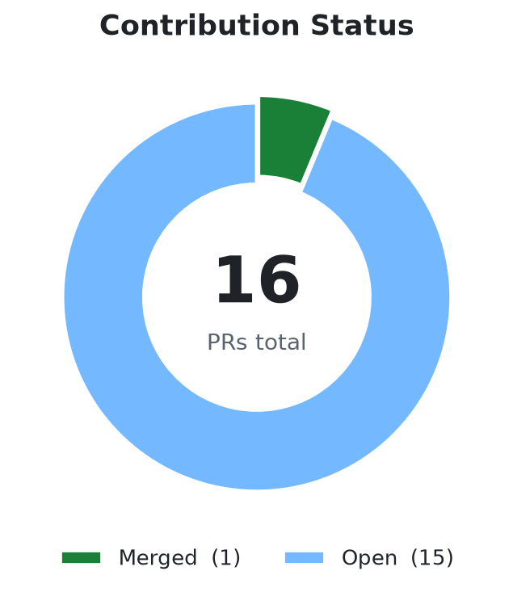

<div align="center">
  <h1>first-contribution</h1>
  <p><strong>An Agent Skill that gets you from "I want to contribute to open source" to a submitted pull request — and refuses to send you at issues that are already dead.</strong></p>

  <p>
    <a href="https://github.com/chjnett/open_contribute/actions/workflows/ci.yml"></a>
    <a href="https://github.com/chjnett/open_contribute/releases/latest"></a>
    <a href="./LICENSE"></a>
    
  </p>
</div>

---

[한국어](./README.ko.md) | English

## The problem

`good first issue` labels lie. On a popular repo the labelled issue you find is usually already claimed, already fixed by a different PR, or quietly resolved with nobody closing the ticket. You read the code, get invested, and then find a linked PR from six months ago.

That is the visible half. The invisible half is worse: a repo can look thriving — daily commits, hundreds of merges a quarter — while merging almost nothing from anyone outside its core team. Stars and activity don't tell you whether *your* PR will land.

<div align="center">
  
</div>

Same day, same method: `grafana/grafana` merges 70% of its PRs from outside its five most frequent authors. `chroma-core/chroma` merges 8% — and every one of the 17 PRs opened against its good-first-issues had failed to merge. Both look healthy from the outside.

Then there's the race. Anything recent, well-scoped and labelled tends to be claimed within hours.

<div align="center">
  
</div>

This skill measures all of that before it recommends anything.

## What's in the box

| Skill | Responds in | Use for |
| :--- | :--- | :--- |
| `first-contribution` | English | Any open-source project |
| `first-contribution-ko` | Korean | Any open-source project |
| `rag-contribution` | English | RAG projects (LangChain, LlamaIndex) |

Each is a self-contained Agent Skill: a `SKILL.md` plus a `references/` folder loaded on demand.

## How it works

1. **Narrows down what you want** — domain, sub-area, stack, experience level, contribution type — before searching, so the recommendation rests on your preferences rather than a guess.
2. **Filters on availability first.** A repo with no currently-open, unassigned contribution issues can't produce a contribution today, and that check is one cheap API call. Only the survivors get the expensive evaluation.
3. **Runs the PR merge reality gate** — the share of open PRs sitting 90+ days, and the share of merges from outside the top-5 authors. You see the numbers and decide; the skill never silently drops a repo.
4. **Triages every candidate issue** against an 8-step checklist: internal-only notices, linked PRs, assignees, resolving comments, claim pile-up, age — and finally whether the defect *still exists in current code*, because a fix can land without anyone closing the issue.
5. **Drafts the outreach** — claim comments, community-channel messages, PR descriptions — in the project's own register.
6. **Walks the contribution** — `gh`-based fork and clone, scoped edits, the project's real test suite, a pre-PR quality checklist covering DCO, signatures and CLAs, then submission and follow-up etiquette.

## Prerequisites

The skill drives forking, cloning and PR creation through the **GitHub CLI (`gh`)**, so no manual personal access tokens.

- **Mac:** `brew install gh`
- **Windows:** `winget install --id GitHub.cli`
- **Linux:** `sudo apt install gh`

```bash
gh auth login --scopes workflow
```

> If you hit SSH host key errors later, run `gh config set git_protocol https`.

## Install

### Claude Code — install as a plugin

Two commands, all three skills, no cloning:

```
/plugin marketplace add chjnett/open_contribute
/plugin install first-contribution@open-contribute
```

### Or paste this prompt to your coding agent

For agents without plugin support. Swap the folder name for whichever variant you want.

```text
Install the first-contribution agent skill for me, and nothing else.

1. Figure out my skills directory (Claude Code → ~/.claude/skills/,
   otherwise my tool's documented skills directory).
2. Clone https://github.com/chjnett/open_contribute into a temp folder.
3. Copy the first-contribution/ subfolder into <skills directory>/first-contribution/.
4. Confirm SKILL.md exists at the root of the copied folder.
5. Do not modify any other files, settings, or skills. Report the final
   install path and stop.
```

Restart your agent to pick up the skill.

### Claude Code — copy the folder yourself

```bash
git clone https://github.com/chjnett/open_contribute /tmp/open_contribute
cp -r /tmp/open_contribute/first-contribution ~/.claude/skills/first-contribution
```

### Claude.ai / Cowork — upload a packaged `.skill`

Download the variant you want from the [latest release](https://github.com/chjnett/open_contribute/releases/latest) and upload it under Settings → Skills. To build the files yourself from a clone:

```bash
bash scripts/package_skill.sh
```

## Use it

The skill triggers on intent — no commands:

> *"I want to start contributing to open source, help me find a good repo and issue"*

> *"Is this repo beginner-friendly? https://github.com/langchain-ai/langchain"*

> *"Find me a good-first-issue in a RAG/Python project."*

## Field notes

Every rule in the checklist was added after it cost a real run something.

### What it has produced

Sixteen pull requests, each found and root-caused by the skill from a cold start — one already merged, the rest in review:

<div align="center">
  
  
</div>

| PR | Bug | State |
| :--- | :--- | :--- |
| [celery/billiard#452](https://github.com/celery/billiard/pull/452) | Worker exceptions were wrapped instead of propagating `BaseException` to the caller | ✅ **merged** |
| [run-llama/llama_index#22723](https://github.com/run-llama/llama_index/pull/22723) | Bedrock Cohere models silently dropped `additional_kwargs`, so `output_dimension` never reached the API | In review |
| [run-llama/llama_index#22724](https://github.com/run-llama/llama_index/pull/22724) | mcp 2.x `streamable_http_client` yields a 2-tuple but `client.py` still unpacked a 3-tuple | In review |
| [run-llama/llama_index#22725](https://github.com/run-llama/llama_index/pull/22725) | `Dispatcher.__init__` used mutable list defaults (`B006`), sharing handler state between instances | In review |
| [dottxt-ai/outlines#2011](https://github.com/dottxt-ai/outlines/pull/2011) | SGLang backend dropped `whitespace_pattern` that vLLM forwards correctly | In review |
| [dottxt-ai/outlines#2012](https://github.com/dottxt-ai/outlines/pull/2012) | `JsonSchema`/`CFG` defined `__eq__` without `__hash__`, making them unhashable | In review |
| [dottxt-ai/outlines#2013](https://github.com/dottxt-ai/outlines/pull/2013) | `mlxlm.generate_batch` used a falsy guard that let truthy-but-falsy output types bypass the check | In review |
| [dottxt-ai/outlines#2014](https://github.com/dottxt-ai/outlines/pull/2014) | `format_output_type` discarded a logits processor whose `__bool__` returns `False` | In review |
| [BerriAI/litellm#37163](https://github.com/BerriAI/litellm/pull/37163) | Redis cluster shutdown dereferenced a `None` connection pool, aborting billing flush | In review |
| [BerriAI/litellm#37164](https://github.com/BerriAI/litellm/pull/37164) | `langfuse_otel` never set observation output for `/v1/rerank` | In review |
| [BerriAI/litellm-docs#912](https://github.com/BerriAI/litellm-docs/pull/912) | Docs referenced nonexistent `litellm.turn_on_message_logging` | In review |
| [psycopg/psycopg#1383](https://github.com/psycopg/psycopg/pull/1383) | Binary copy field length exceeding data raised a generic error instead of `DataError` | In review |
| [sqlfluff/sqlfluff#8350](https://github.com/sqlfluff/sqlfluff/pull/8350) | Unpinned `pip-tools` in the Dockerfile broke `pip-compile` | In review |
| [onyx-dot-app/onyx#14011](https://github.com/onyx-dot-app/onyx/pull/14011) | Vision-LLM warning fired for batches without images | In review |
| [grafana/grafana#130614](https://github.com/grafana/grafana/pull/130614) | Copied short URLs carried `orgId=org-5` because the resource namespace was used as the org ID | In review |
| [directus/directus#28092](https://github.com/directus/directus/pull/28092) | GraphQL fragments on an M2A union resolved every field to `null` | In review |

The second run is the better illustration of the funnel: 30 backend repos screened for availability → 13 with open contribution issues → 11 through the merge gate → **229 candidate issues checked for linked PRs** → 26 still claimable → one with a defect verified live in `main`.

### What each rule cost

- **`chroma-core/chroma`** — 29k stars, pushed daily, 11 open `good first issue`s. Also 275 of 452 open PRs sitting 90+ days, 8% of merges from outside the top-5 authors, and 17 of 17 PRs against those labelled issues failed to merge. The gate exists because of this repo.
- **`deepset-ai/haystack`** — passes the gate comfortably, and its contribution labels are *empty*: 199 such issues total, zero open. An empty label on a healthy repo means "come back later," which is the opposite diagnosis from a rotten one.
- **`argoproj/argo-cd#29051`** — 8 days old, unassigned, zero linked PRs, `severity:critical`. It passed every social check and had already been fixed by `v3.3.14`. That is why the checklist now verifies the defect against current code.
- **Both PRs' existing tests asserted the buggy output.** Grafana's expected `orgId=org-5`; Directus's would have broken on the obvious fix because its mock schemas define `relations` and no `collections`. Read the fixtures before choosing how to write a fix.
- **CLAs are not all the same.** Grafana uses an external signing service; Directus asks you to add your username to `contributors.yml` *inside the PR* — a one-line diff that is nonetheless the act of signing. The skill will never do that for you.
- **A second-hand summary of your own PR is a claim, not the state.** One arrived asserting 28 workflows awaited approval on the Grafana PR; the API showed zero. Acting on it would have burned the single follow-up nudge on a non-problem.

## Reproducing the charts

The merge-gate and triage charts come only from measurements taken on 2026-08-12, with the method printed on each chart; the contribution charts track PRs opened through this skill via `gh` (as of 2026-08-17):

```bash
python3 scripts/generate_charts.py
```

## Troubleshooting

| Error / symptom | Fix |
| :--- | :--- |
| **"refusing to allow an OAuth App to create or update workflow... without workflow scope"** | Your `gh` token can't push to repos with GitHub Actions:<br>`gh auth refresh --scopes workflow` |
| **"The value of the GITHUB_TOKEN environment variable is being used for authentication."** | An old token is stuck in your environment:<br>`unset GITHUB_TOKEN` (Mac/Linux) or `Remove-Item Env:\GITHUB_TOKEN` (Windows) |
| **"Host key verification failed"** during clone | SSH keys aren't set up; switch `gh` to HTTPS:<br>`gh config set git_protocol https`. If that can't write its config, the fork is still created — clone it over HTTPS explicitly:<br>`git clone https://github.com/{user}/{repo}.git` then `git remote add upstream https://github.com/{owner}/{repo}.git` |
| **"Commits must have verified signatures"** | The repo requires signed commits. `git commit -s` is DCO sign-off and does **not** satisfy this — you need a signing key, or commit via GraphQL `createCommitOnBranch`. |
| **CLA check stays pending** | Only you can sign a CLA. Follow the bot's link from the PR itself; if the page renders blank, a content blocker is usually eating the agreement text. |

## Contributing

Built and refined in public while being used for real contributions. If it recommends a stale issue, misjudges a repo, or misses a project convention, open an issue — that feedback is what the checklist is made of.

## License

[MIT](./LICENSE). Use it, fork it, build on it.
